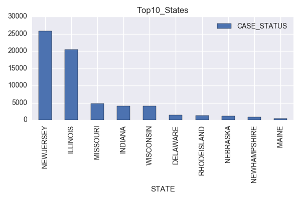

#### README
# Final Exam - Spring 2017

##DATA SOURCE :
- [H1B Petitions](https://www.kaggle.com/nsharan/h-1b-visa)
- Considering only petitions for the year 2016

## Analysis 1 :
- Considering only H1B petitions for part time positions in this analysis
- Analyzing the success ratio for  H1B petitions for each Job in every state 
- Top 10 states with the maximum number of H1B applications 

## Analysis 2 :
- Considering only H1B petitions for full time positions in this analysis
- Plotting the concentration of H1B applications on map of USA using folium and Scatter plot
  

## Analysis 3 :
- Considering the H1B petitions of Computer Programmers across USA
- Finding the mean wages for Computer Programmers for every state and sorting them highest to lowest
- Finding the most common Job Titles under Computer Programmers
 

## Analysis 4 :
- Analyzed the companies which applied for H1B the most in 2016 
- Found out roles of the applicants from the top applying company and the location of that company which has the most applicants 

## Analysis 5 :
- Considering only H1B petitions for full time positions
- Finding the state with highest number of petitions
- Calculating the mean wages of every city in that state
- Finding out the min,max,mean wages of every employer in that state and displaying the top 10 companies 
 
